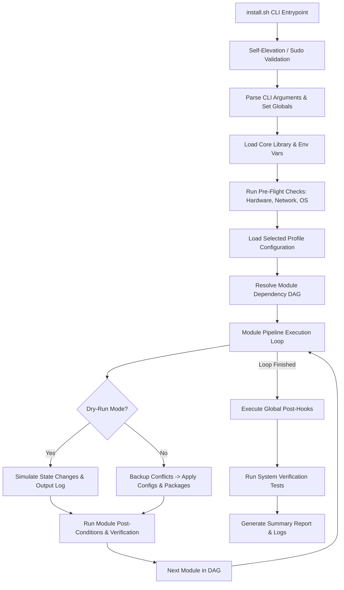

# Forge: AI Context & Architectural Specification

This document is the single source of truth for all AI systems working on this repository. All code contributions, script modifications, and architecture updates must adhere to the guidelines below.

---

## 1. Project Vision

**Forge is an opinionated Hyprland dotfiles project for developers.**

A user clones the repository, runs `./install.sh` on a fresh Arch Linux installation, reboots, and is immediately using the Forge desktop. No wizard. No profile selection. One desktop.

### What It Is
* **Dotfiles project**: Real configuration files for every tool in the Forge desktop, deployed as symlinks into `~/.config/`.
* **Self-reproducing desktop**: The installer exists solely to reproduce the Forge desktop automatically — packages, services, and dotfiles in a single command.
* **Single-command bootstrapper**: `./install.sh` transforms a clean Arch Linux install into a fully configured Hyprland workstation.
* **Safe and idempotent**: Dry-run support, automatic config backups, and re-entrant execution — running the installer twice is safe.

### What It Is Not
* **Not a configuration framework**: Forge does not support profiles, desktop selection, or a plugin marketplace.
* **Not a shell script collection**: Every component is structured, tested, and has a defined lifecycle (install / verify / uninstall).
* **Not a one-time installer**: The installer is idempotent and can be re-run to repair or update an existing installation.

### Installer Scope (hard boundary)
The installer does exactly these things and nothing else:
1. Install packages (pacman + AUR)
2. Enable systemd services
3. Deploy dotfiles via symlinks
4. Verify the installation
5. Provide uninstall / rollback

---

## 2. Design Philosophy

Every contribution must be guided by these six pillars:

1. **Idempotency**: Running the framework or any individual module multiple times on the same system must yield the exact same target state. File modifications, package installations, and system services must only execute if they are not already in their target state.
2. **Reproducibility**: The exact same configuration options and profiles must result in identical systems when run on identical hardware. External dependencies (like mirrorlists or git repositories) must be handled deterministically.
3. **Modularity**: Modules must be encapsulated and completely decoupled. One module must never directly mutate the internal state or files of another module. Inter-module dependencies must be declared explicitly.
4. **Safety & Non-Destructiveness**: Existing user configuration files must never be silently overwritten. Automatic, time-stamped backups must be generated before any file modification.
5. **Dry-Run first**: The framework must support a `--dry-run` or `-d` mode which traverses the execution pipeline, checks prerequisites, validates package lists, and prints all planned state changes without writing anything to disk or installing packages.
6. **Extensibility**: Users must be able to add profiles and modules without modifying the core installer framework code.

---

## 3. Architecture Overview

The system is organized into a core runtime engine, a profile selector, and the module pipeline.



### Execution Lifecycle
1. **Bootstrap Phase**: The user executes `./install.sh` with specific arguments (profile, dry-run, verbose).
2. **Pre-flight Phase**: Verification of environment limits (is OS Arch Linux? is network available? does target user have sudo privileges?).
3. **Resolve Phase**: Load profile definitions (lists of modules to enable) and order module execution based on dependency metadata.
4. **Execution Phase**: Loop through modules executing lifecycle scripts (`install.sh`, `update.sh`).
5. **Validation Phase**: Run unit/integration tests to verify the target state was achieved.

---

## 4. Directory Structure

The repository maintains a strict layout. AI assistants must never create top-level directories outside this schema.

```text
arch-config/
├── .git/                  # Git metadata
├── .gitignore             # Ignored files configuration
├── LICENSE                # Open source license
├── README.md              # Main entry documentation for users
├── install.sh             # Main installation bootstrapper
├── uninstall.sh           # Main cleanup and rollback entrypoint
├── assets/                # Static visual assets (screenshots, icons)
├── bin/                   # Framework wrappers and helper binaries
├── docs/                  # Architectural documentation (including AI_CONTEXT.md)
├── dotfiles/              # Global dotfile templates (shared across modules)
├── fonts/                 # Globally installed system fonts
├── lib/                   # Reusable framework libraries (modules.sh, pkg.sh, log.sh)
├── modules/               # Feature-specific package and config modules
│   ├── base/              # Essential OS modules (pacman, systemd)
│   ├── desktop/           # Desktop Environments & Window Managers
│   └── shell/             # Zsh, Bash, Tmux, utilities
├── packages/              # Global package registry list configurations
├── scripts/               # Developer utilities and offline tools
├── tests/                 # Bats integration and unit test suite
├── themes/                # Global theme assets (GTK, Icons, Wallpapers)
└── wallpapers/            # System wallpapers
```

---

## 5. Responsibility of Every Directory

* **`bin/`**: Holds CLI user entry points. These are executable wrappers. Do not place business logic here; delegate to `lib/`.
* **`docs/`**: Developer guides, usage tutorials, and metadata mappings. No code or templates.
* **`dotfiles/`**: Shared static dotfiles that apply system-wide or across multiple modules. Use subdirectories matching the target path in `$HOME` or `/etc`.
* **`fonts/`**: Store custom `.otf` and `.ttf` files that are deployed system-wide.
* **`lib/`**: The heart of the framework. Contains pure, stateless library files (`log.sh`, `error.sh`, `pkg.sh`, `dotfile.sh`, `sys.sh`). Libraries must only contain functions and shell configurations; they must not execute top-level commands.
* **`modules/`**: Contains subfolders for individual components. Each subfolder is a self-contained module containing its own lifecycle scripts (`install.sh`, `uninstall.sh`, `test.sh`), specific configuration templates, and lists of dependencies.
* **`packages/`**: Stores flat-text package lists grouped by function or manager (e.g., `pacman.lst`, `aur.lst`, `flatpak.lst`).
* **`scripts/`**: One-off maintainer scripts (e.g., benchmark scripts, package list updates, formatting checkers).
* **`tests/`**: Integration test files written in `bats-core` evaluating the functionality of libraries and installer modules.
* **`themes/`**: Visual theme declarations. No system scripting.

---

## 6. Bash Coding Standards

To ensure safety, performance, and clean execution, all Bash scripts must conform to the following strict specifications.

### Shell Settings & Safety Boilerplate
Every `.sh` script file (and `.bats` test file) must start with a standard header and configuration traps:

```bash
#!/usr/bin/env bash

# Use strict bash options
set -Eeuo pipefail

# Ensure script is run from a clean environment
export LC_ALL=C.UTF-8

# Resolve the absolute script path safely
readonly SCRIPT_DIR="$(cd "$(dirname "${BASH_SOURCE[0]}")" && pwd)"
```

* `-e`: Exit immediately if a command exits with a non-zero status.
* `-u`: Treat unset variables as an error.
* `-o pipefail`: Return value of a pipeline is the status of the last command to exit with non-zero, or zero if all succeed.
* `-E`: Inherit shell traps in shell functions, command substitutions, and subshells.

### Code Style Rules
1. **Indentation**: Exactly 2 spaces. No tabs.
2. **Line Length**: Max 100 characters. Break long commands with a trailing backslash (`\`) indented by 4 spaces.
3. **Variables**:
   * Always wrap variables in curly braces and double quotes: `"${variable_name}"` (unless word-splitting is explicitly desired and commented).
   * Declare local variables inside functions using `local`.
   * Declare constant values using `readonly` at the top level or inside functions.
4. **Conditionals & Comparisons**:
   * Always use double brackets `[[ ... ]]` for testing conditions, never `[ ... ]` or `test`.
   * Use standard numerical comparisons (`-eq`, `-gt`, `-lt`) for integers and string operators (`==`, `!=`) for text comparisons.
5. **Command Substitutions**: Use `$(command)` instead of backticks.
6. **Subshells**: Avoid subshells unless isolating state. Prefer Bash built-ins over external forks (e.g. use `${var##*/}` instead of calling `basename`).

### Basic Syntax Template
```bash
# Good function declaration
utils::check_dir() {
  local target_dir="${1}"

  if [[ ! -d "${target_dir}" ]]; then
    log::error "Directory does not exist: ${target_dir}"
    return 1
  fi

  return 0
}
```

---

## 7. Naming Conventions

Maintain consistency across the codebase to ensure ease of navigation.

| Scope | Convention | Case | Example |
| :--- | :--- | :--- | :--- |
| **Directory Name** | Kebab Case | lowercase | `window-manager`, `core-utils` |
| **Script Filename** | Snake Case | lowercase | `install_hooks.sh`, `pkg_helpers.sh` |
| **Binary Filename** | Kebab Case | lowercase | `install.sh`, `uninstall.sh` |
| **Global Constants** | Upper Snake Case | UPPERCASE | `ARCH_CFG_ROOT_DIR`, `PACMAN_LOG` |
| **Local Variables** | Snake Case | lowercase | `pkg_count`, `target_path` |
| **Functions** | Namespaced | lowercase | `log::info`, `pkg::install`, `fs::symlink` |

### Function Namespacing
All functions inside `lib/` must be prefixed with the file name to prevent collision:
* Functions in `lib/pkg.sh` -> `pkg::install_packages`, `pkg::is_installed`
* Functions in `lib/fs.sh` -> `fs::create_symlink`, `fs::backup_file`

---

## 8. Logging Conventions

The framework must produce clean, structured, and informative logs.

### Level Guidelines
* **DEBUG**: Highly verbose diagnostic outputs. Hidden by default, visible only with `-v` or `--verbose`.
* **INFO**: Standard informational outputs (e.g., "Installing neovim...").
* **WARN**: Minor anomalies that do not stop installation (e.g., "Optional package not found, skipping").
* **ERROR**: An action failed, but recovery is possible.
* **FATAL**: Severe error that halts the execution immediately.

### Format
Stderr must print colored status lines when connected to an interactive TTY, and plain text when output is redirected to log files.
```text
[2026-06-28 15:37:32] [INFO]  [CORE]: Bootstrapping packages...
[2026-06-28 15:37:34] [WARN]  [DWM]: config.h not found, using default.
[2026-06-28 15:37:35] [FATAL] [SYS]: System is not Arch Linux! Exiting.
```

### Code Standard for Logs
All standard messages must output to Standard Error (`>&2`). Standard Output (`>&1`) is reserved exclusively for clean machine-readable output or pipe downstream flows.

```bash
# Core logging implementation structure in lib/log.sh
log::info() {
  local msg="${1}"
  local ns="${2:-CORE}"
  if [[ -t 2 ]]; then
    printf "\e[32m[%s] [INFO]  [%s]: %s\e[0m\n" "$(date +'%Y-%m-%d %H:%M:%S')" "${ns}" "${msg}" >&2
  else
    printf "[%s] [INFO]  [%s]: %s\n" "$(date +'%Y-%m-%d %H:%M:%S')" "${ns}" "${msg}" >&2
  fi
}
```

---

## 9. Error Handling Philosophy

Scripts must never crash silently or continue running in a degraded/corrupted state.

### ERRTrap and Stack Traces
Every script must hook the `ERR` signal. The error handler must extract the call stack using `${BASH_SOURCE[@]}` and `${BASH_LINENO[@]}`.

```bash
# Core error handler in lib/error.sh
err::handle() {
  local exit_code="${1}"
  local last_command="${2}"
  local source_file="${3}"
  local line_no="${4}"

  log::fatal "Command '${last_command}' failed with exit code ${exit_code} in ${source_file} at line ${line_no}"
  
  # Print call stack
  local i
  log::error "Call stack:"
  for ((i = 1; i < ${#FUNCNAME[@]}; i++)); do
    log::error "  at ${FUNCNAME[i]} (${BASH_SOURCE[i]}:${BASH_LINENO[i-1]})"
  done
  
  exit "${exit_code}"
}
```

### Exit Codes Specification
* `0`: Operation completed successfully.
* `1`: General catch-all runtime error.
* `2`: Invalid CLI arguments or configurations.
* `10`: Pre-flight / environment validation failures.
* `20`: Package installation / mirrors verification failures.
* `30`: Configuration linking / permissions failure.
* `40`: Verification/test suite verification failures.
* `50`: Rollback failure.

---

## 10. Dependency Management

Modules frequently depend on other modules or system conditions. These must be checked explicitly.

1. **Circular Dependency Prevention**: High-level modules (e.g., `modules/desktop/hyprland`) can depend on basic modules (e.g., `modules/base/xorg`), but base modules can never depend on high-level ones.
2. **Metadata Declarations**: Each module must specify its dependencies in a manifest configuration (`module.json` or inline metadata array).
3. **Execution Dependency Graph**: The installer engine must build a Directed Acyclic Graph (DAG) using topological sorting to resolve the order of execution.
4. **Command Checks**: Never assume utility tools exist. Always use a helper to check requirements before runtime:

```bash
sys::require_command() {
  local cmd="${1}"
  if ! command -v "${cmd}" &>/dev/null; then
    log::fatal "Required command '${cmd}' is missing."
    exit 10
  fi
}
```

---

## 11. Module Architecture

A Module must be structured as a self-contained environment. It must adhere to the following schema:

```text
modules/my-module/
├── metadata.sh       # Module metadata (dependencies, version, author)
├── install.sh        # Installation steps (idempotent)
├── uninstall.sh      # Rollback mechanism
├── update.sh         # Run on framework updates
├── test.sh           # Unit verification script (bats test suite runner)
├── dotfiles/         # Module-specific config files to link
└── templates/        # Module configuration templates for generation
```

### Lifecycle Interface Rules
* Lifecycle scripts (`install.sh`, `uninstall.sh`, etc.) must be executable and contain the safety standard header.
* Scripts must use core framework libraries (`lib/`) for actions like logging, package management, and dotfile linking instead of executing raw commands.
* If a module needs to change a global system setting, it must use the registered API of the responsible module or core library.

---

## 12. Package Management Strategy

Managing software packages on Arch Linux requires robustness. The system uses a wrapper over official repository tools (`pacman`) and AUR helpers (`paru` or `yay`).

### Architecture Rules
* **No Direct Calls**: Never write `sudo pacman -S package` or `yay -S package` inside module lifecycle scripts. Always utilize `lib/pkg.sh`.
* **State Check**: Before attempting to install, verify if the package is already active using `pacman -Qq package` or equivalent.
* **AUR Bootstrap**: The package manager wrapper must check for the presence of an AUR helper. If none is installed, it must safely build and configure `paru` in a transient directory under a dedicated non-root user.
* **Consolidated Transactions**: Package installations should be queued and installed in a single unified operation to minimize package index sync overhead.

### Safe Package Helper Example (`lib/pkg.sh`)
```bash
pkg::install() {
  local pkg_name="${1}"
  
  if pacman -Qq "${pkg_name}" &>/dev/null; then
    log::info "Package '${pkg_name}' is already installed (skipping)"
    return 0
  fi

  log::info "Installing package: ${pkg_name}"
  if [[ "${ARCH_CFG_DRY_RUN}" == "true" ]]; then
    log::info "[DRY-RUN] Would install package: ${pkg_name}"
    return 0
  fi

  # Call package manager logic (checks if official or AUR)
  # ...
}
```

---

## 13. Dotfile Management Strategy

Configuration tracking requires safeguarding existing user environments.

### The Strategy
* **Symlink Engine**: The framework links configuration templates from the repository to their destination directories (typically in `$XDG_CONFIG_HOME` or `$HOME`).
* **Safe Overwriting**: If a target file exists:
  1. Check if the target is already a symlink pointing to the repository file. If yes, skip (idempotency).
  2. If it is a file/directory, back it up.
  3. Remove the target or move it to a backup directory.
  4. Create the symlink.
* **Backups**: Create backups in `$XDG_STATE_HOME/arch-config/backups/YYYYMMDD-HHMMSS/` to keep clean config directories.
* **Templates Resolution**: Files in `templates/` are compiled before linking (replacing placeholders like `{{USER_HOME}}` or `{{INTERFACE}}` with active runtime values) and written to a cache directory before linking.

### File Operations Standard (`lib/fs.sh`)
```bash
fs::safe_link() {
  local source_file="${1}"
  local target_link="${2}"

  if [[ -L "${target_link}" ]]; then
    local current_target
    current_target="$(readlink -f "${target_link}")"
    if [[ "${current_target}" == "${source_file}" ]]; then
      return 0 # Link is already correct
    fi
  fi

  if [[ -e "${target_link}" ]]; then
    fs::backup "${target_link}"
    rm -rf "${target_link}"
  fi

  mkdir -p "$(dirname "${target_link}")"
  ln -sf "${source_file}" "${target_link}"
  log::info "Linked: ${target_link} -> ${source_file}"
}
```

---

## 14. Installer Flow

When `install.sh` runs, it must execute in the following precise sequence:

1. **Initialize Engine**: Load core environment variables and read configurations.
2. **Elevate Privileges**: Check if executing as root. If not, request `sudo` and keep sudo credentials alive in the background via a daemon loop.
3. **Parse Arguments**: Identify profile, verbose modes, dry-run flags, and targets.
4. **Validation**: Check OS validity, system resources (disk space, swap space), internet connectivity, and hardware specifications (e.g. processor type for microcode loading).
5. **Load Profile**: Read profile definitions mapping which modules to run.
6. **Compile Dependencies**: Build the execution pipeline DAG using topological sorting.
7. **Pre-Hook Execution**: Run global configurations (e.g., reflector check, update pacman database keys).
8. **Module Lifecycle Execution**: For each module in the resolved DAG:
   1. Check prerequisites.
   2. Deploy packages via package utility.
   3. Render configuration templates and deploy dotfiles.
   4. Trigger services activation (systemd enable/start).
   5. Run module test suite (`test.sh`).
9. **Post-Hook Execution**: Perform environment updates (reloading fonts cache, compiling schema databases, rebuilding initramfs).
10. **Report Output**: Compile a list of installed modules, errors encountered, logs, backups, and output execution statistics.

---

## 15. Testing Strategy

All library components and installations must be tested continuously.

### Unit Tests with Bats
We use the Bats framework (`bats-core`, `bats-assert`, `bats-support`) for shell testing. Tests are stored in the `tests/` directory.

### Mocking External Commands
Tests must verify the logical branches of functions without altering the host machine. Mock dependencies (like `pacman`, `systemctl`, `systemd-detect-virt`) during tests.

### Bats Test Template (`tests/test_pkg.bats`)
```bats
#!/usr/bin/env bats

load 'test_helper'

setup() {
  # Mock external executables
  mock_bin() {
    local name="${1}"
    local mock_code="${2}"
    echo -e "#!/bin/sh\n${mock_code}" > "${BATS_TMPDIR}/${name}"
    chmod +x "${BATS_TMPDIR}/${name}"
  }

  export PATH="${BATS_TMPDIR}:${PATH}"
  source "${BATS_TEST_DIRNAME}/../lib/pkg.sh"
}

@test "pkg::install skips if pacman reports package is already installed" {
  mock_bin "pacman" "echo 'neovim 0.9.1-1'"
  
  run pkg::install "neovim"
  [ "${status}" -eq 0 ]
  [[ "${output}" =~ "already installed" ]]
}
```

---

## 16. Documentation Standards

* **`AI_CONTEXT.md`**: Main repository rulebook for AI engines. Never alter this without permission or major architectural refactoring.
* **Module README**: Every module directory must contain a `README.md` file listing dependencies, installed packages, targets (files/configs), and customizable variables.
* **ShellDoc Syntax**: Every function in `lib/` must include a descriptive header block detailing description, arguments, global variables accessed, stdout outputs, and return codes.

```bash
# @description Safe creation of a symbolic link with automatic backup
# @arg1 string Source file path (absolute)
# @arg2 string Destination link path (absolute)
# @globals ARCH_CFG_DRY_RUN
# @stdout Log message explaining the action
# @exit 0 On success or when action is skipped
# @exit 30 On execution failure or permission issues
fs::safe_link() { ... }
```

---

## 17. Git Workflow

We use a clean, linear development workflow.

1. **Development Branches**: All changes are developed on separate topic branches (`feature/`, `bugfix/`, `refactor/`).
2. **Rebase Integration**: Direct merges to `main` are restricted. Branches must be rebased on the latest `main` branch state before merging to prevent merge commits.
3. **Pull Requests**: Pull requests must pass automated checks (ShellCheck, unit tests) prior to approval.
4. **Tagging**: Releases are marked using semantic versioning tags (`v1.0.0`, `v1.1.0-alpha`).

---

## 18. Commit Message Conventions

Commit messages must follow the standard **Conventional Commits** specification. This is essential as changelogs are generated automatically.

### Format
```text
<type>(<scope>): <description>

[optional body]

[optional footer(s)]
```

### Types
* **`feat`**: A new feature (e.g. adding a new module or profile option).
* **`fix`**: A bug fix (e.g., resolving a broken package installation state).
* **`docs`**: Documentation adjustments only.
* **`style`**: Formatting changes (no logic changes).
* **`refactor`**: Code changes that neither fix bugs nor add features.
* **`perf`**: Code modifications intended to improve performance.
* **`test`**: Testing modifications (adding/refactoring tests).
* **`chore`**: Maintenance work, framework files (configs, workflows).

### Examples
* `feat(lib): implement topological sort module DAG resolver`
* `fix(neovim): repair init.lua syntax error in configurations`
* `docs(ai): incorporate new naming conventions to context file`

---

## 19. Code Review Checklist

Reviewers and AI checkers must audit all code changes against these conditions:

* [ ] **Shellcheck**: The script must be completely free of ShellCheck warnings. Disable rules only if technically justified and documented inline.
* [ ] **Idempotence**: Running the script a second time produces no new mutations.
* [ ] **Dry-Run Compatibility**: Code blocks modifying system state (files, packages, service states) check for execution flags: `if [[ "${ARCH_CFG_DRY_RUN}" != "true" ]]; then ...`.
* [ ] **Destruction Checks**: Does the code verify and backup user target files before executing links or writes?
* [ ] **Error Catching**: Are all commands that can fail checked, or is the script using safety traps?
* [ ] **Variable Scoping**: Are all function variables declared using `local`?
* [ ] **Namespace Compliance**: Are library functions namespaced (e.g., `pkg::*`)?
* [ ] **Test Coverage**: Does the refactored script include corresponding tests in `tests/`?

---

## 20. Performance Considerations

* **Minimize Forks**: Avoid subshells (`$(...)`) and pipelines when Bash internal parameter expansion can accomplish the operation.
* **Consolidate Package Transactions**: Queue dependencies and invoke `pacman` or `paru` once. Running package managers multiple times adds package index metadata overhead.
* **Optimized I/O**: Limit writing temporary files to hard drives. Use `/tmp` (which resides on a `tmpfs` RAM disk under Arch Linux) for operational temp files.
* **Asynchronous execution**: Run tasks that don't depend on each other (e.g., fetching configuration templates and syncing package mirrorlists) in parallel using background processes (`&` and `wait`).

---

## 21. Security Guidelines

1. **No Credentials Tracking**: Never store private passwords, API keys, or GPG keys in git. Always load credentials dynamically from system secret storage or prompt the user.
2. **Safe Curl and Wget**: Avoid piping scripts directly to bash from external sources (`curl -sSL url | bash`). Download the script to `/tmp`, verify its checksum or contents, and then execute.
3. **Restricted Sudo Permissions**: Limit root actions to commands that require privileges. Run configuration installations and links as the standard user. Do not execute the entire framework execution loop as root; let the framework call `sudo` only when executing root tasks (e.g., system package manager calls or systemd commands).
4. **File Permissions**: Explicitly set secure file permissions on created configuration files containing keys or system authorization directives (e.g., SSH configs `0600`, SSH folders `0700`).

---

## 22. AI Contribution Guidelines

To ensure stable contributions, AI assistants must adhere to these directives:

* **Read the Context**: AI models must load this file (`docs/AI_CONTEXT.md`) and the relevant modules' files before suggesting code updates.
* **No Speculative Coding**: If requirements are ambiguous, ask for clarification. Do not guess directory targets or package dependency chains.
* **Preserve API Contracts**: Do not rewrite signatures or change functional return types in `lib/` libraries without checking all matching calls across modules.
* **Incremental Updates**: Introduce changes iteratively. Ensure tests pass before adding further functionality.
* **Aesthetics Matter**: If creating configuration files or theme templates, follow the specified design standards.

---

## 23. Things AI Must Never Do

* **Do NOT use `rm -rf` without verification**: Path variables must be verified to prevent executing `rm -rf "${empty_var}/"` or deleting user root storage.
* **Do NOT use standard `[` command evaluations**: Always use double brackets `[[ ... ]]`.
* **Do NOT write code with unquoted variables**: Always wrap variables: `"${var}"`.
* **Do NOT modify library APIs directly**: Changing shared library interfaces (`lib/*.sh`) must be done with extreme care. Always update usage patterns across all modules.
* **Do NOT ignore ShellCheck warnings**: Do not disable warnings globally. Only disable them inline for specific, explained reasons using `# shellcheck disable=SCxxxx`.
* **Do NOT add personal custom tools**: Stick to the pre-approved libraries and command utilities specified in this context document.

---

## 24. Future Roadmap

* **Phase 1: Core Engine Integration**
  * Finalize validation layers, command checking, and dynamic error traps.
  * Integrate topological module sorting and DAG resolution.
* **Phase 2: Reliability and Safety**
  * Build complete file rollback system.
  * Finalize VM integration testing setups (QEMU/Docker configurations).
* **Phase 3: Profiles and Customization**
  * Establish custom workspace profiles (`workstation`, `developer`, `minimal-server`).
  * Integrate mirror optimization scripts.
* **Phase 4: Advanced Framework Features**
  * Parallel module execution routines.
  * GUI/TUI wizard launcher interface.

---

## 25. Definition of Done for Every Feature

A feature, module, or code modification is considered complete only when it meets all the following standards:

1. **Clean Code**: Code passes shellcheck without warnings.
2. **Idempotence Verified**: Executing the changes multiple times produces no state variations on target environments.
3. **Dry-Run Functional**: Running the CLI with `--dry-run` shows planned state alterations without making actual modifications.
4. **Safety Checked**: Overwritten files are backed up automatically.
5. **Robust Tests**: Comprehensive Bats integration and unit test coverage is present and verified.
6. **Documentation Updated**: Module README has details of package lists, settings, and functions. All new functions contain ShellDoc headers.
7. **Clean Git History**: Changes are contained in a single branch, rebased cleanly onto main, with standard conventional commits.
